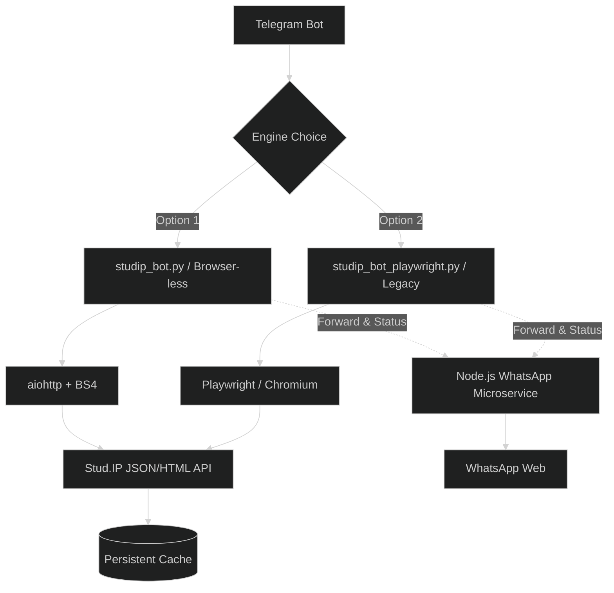

# 🎓 Uni Oldenburg Study Assistant Bot

<div align="center">


</div>

The ultimate Telegram companion for students at the **University of Oldenburg**. This bot seamlessly bridges the gap between the **Stud.IP** portal and your daily messaging app, providing real-time intelligence on your academic life.

---

## 🌗 Choose Your Engine

This project offers two distinct ways to interact with Stud.IP. You can select your preferred engine during the initial setup via `setup.sh`.

| Feature | 🚀 Browser-less (Standard) | 🌐 Playwright (Legacy) |
| :--- | :--- | :--- |
| **Logic** | Direct JSON/HTML requests | Simulated Browser (Chromium) |
| **Speed** | ⚡ Instant Sync | 🐢 Slower (Browser overhead) |
| **RAM Usage** | ~50MB - 100MB | ~500MB - 1GB+ |
| **Stability** | High (No browser crashes) | Medium (Requires display/driver) |
| **Best For** | Production/Cloud Servers | Local Desktop / Debugging |
| **File** | `studip_bot.py` | `studip_bot_playwright.py` |

---

## ✨ Power Features

### 📅 Smart Scheduling & Reminders
*   **Morning Summary (07:00 AM)**: Get a daily briefing delivered to your chat.
    *   **Today's Schedule**: A clean list of your lectures and locations.
    *   **Mensa Menu**: The full cafeteria menu with allergens and special labels (e.g., ⭐ Limited).
*   **Lecture Reminders**: Automatically receive a notification **30 minutes before** each class starts. No more running late across campus!

### 📊 Real-time Monitoring (Unified Watcher)
The bot runs a state-of-the-art background loop that tracks:
*   **📢 Announcements**: Instant forwarding of course updates and news.
*   **📁 File Manager**: Detects new uploads. Download files **directly** with one click.
*   **💬 Forum Discussions**: Stay in the loop with new posts and full conversation history.
*   **📨 Direct Messages**: Never miss an important message from lecturers or peers.
*   **🟢 WhatsApp Integration**: Forward any announcement or message directly to a target WhatsApp group with the tap of a button. The bot runs a local Node.js microservice to handle secure WhatsApp Web sessions.

### 🍽️ Enhanced Mensa Menu
A beautiful, emoji-rich menu with:
- Pricing for students/guests.
- Full allergen and additive guide.
- **Smart Filtering**: Identification of Vegan (🌿 V+), Vegetarian (🥗 V), and meat types.

---

## 🛠️ Installation & Deployment

**Recommended Setup (Unix/Mac):**

```bash
git clone https://github.com/ofurkancoban/UniOldenburgStudyAssistantBot.git
cd UniOldenburgStudyAssistantBot
chmod +x setup.sh
./setup.sh
```

**What the script does for you:**
1.  **Environment Isolation**: Creates and activates a Python `.venv`.
2.  **Dependency Resolution**: Installs all required libraries (`icalendar`, `aiohttp`, etc.).
3.  **Engine Selection**: Lets you choose between the Browser-less and Playwright versions.
4.  **Configuration**: Generates a `.env` template from your input.

---

## ⚙️ Configuration (`.env`)

```ini
# --- Credentials ---
USERNAME=your_studip_id
PASSWORD=your_password
TELEGRAM_TOKEN=your_bot_token

# --- Authentication ---
ALLOWED_USER_IDS=123456,789012  # Comma separated list of authorized users
TOTP_SECRET=YOUR_KEY            # Optional: If 2FA/App Authenticator is enabled

# --- Calendar Integration ---
STUDIP_ICAL_URL=https://elearning.uni-oldenburg.de/dispatch.php/ical/index/...

# --- WhatsApp Integration ---
WHATSAPP_GROUP_NAME="StudIP Alerts"
PORT=3838  # Port for the WhatsApp Microservice
```

> [!IMPORTANT]
> To get your **STUDIP_ICAL_URL**, go to Stud.IP:
> **Planner** -> **Export** -> **iCalendar** -> Copy the link. This link is essential for the schedule and reminders to work!

---

## 🤖 Available Commands

| Command | Description |
| :--- | :--- |
| `/start` | Start the bot and login. |
| `/menu` | The main hub. Access Courses, Files, and Calendar. |
| `/check` | Manual sync of all watchers (Files, News, Posts). |
| `/status` | View system health, uptime, last sync timestamps, and **request WhatsApp QR code / change target WhatsApp group**. |

---

## 📱 WhatsApp Integration Setup

1. **Auto-Start**: When you launch the bot (`python studip_bot.py`), it automatically starts the WhatsApp microservice in the background.
2. **First Time Login (QR)**: The bot will generate a WhatsApp Web QR code and send it to you via Telegram as an image. Scan it with your phone's WhatsApp (Linked Devices).
3. **Change Target Group**: Use the `/status` menu and click **"✏️ Change WA Group"** to dynamically change the group where messages are forwarded.
4. **Session Persistence**: Your session is saved securely. If you need a new QR code (e.g., you logged out), simply tap **"📲 Request WA QR"** in the `/status` menu.

---

## 🏗️ Technical Architecture



---

## ⚠️ Disclaimer
This tool is **unofficial** and not affiliated with the University of Oldenburg. Please use responsibly and adhere to the university's IT usage policies.

---
**Efficiency meets Automation.** 🎓✨
