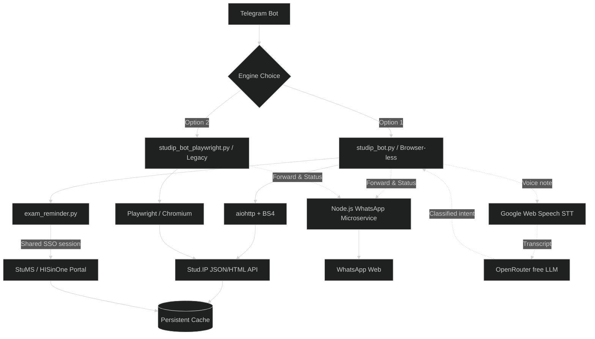

# 🎓 Uni Oldenburg Study Assistant Bot

<div align="center">


</div>

The ultimate Telegram companion for students at the **University of Oldenburg**. This bot seamlessly bridges the gap between the **Stud.IP** portal and your daily messaging app, providing real-time intelligence on your academic life.

---

## 🌗 Choose Your Engine

This project offers two distinct ways to interact with Stud.IP. You can select your preferred engine during the initial setup via `setup.sh`.

| Feature | 🚀 Browser-less (Standard) | 🌐 Playwright (Legacy) |
| :--- | :--- | :--- |
| **Logic** | Direct JSON/HTML requests | Simulated Browser (Chromium) |
| **Speed** | ⚡ Instant Sync | 🐢 Slower (Browser overhead) |
| **RAM Usage** | ~50MB - 100MB | ~500MB - 1GB+ |
| **Stability** | High (No browser crashes) | Medium (Requires display/driver) |
| **Best For** | Production/Cloud Servers | Local Desktop / Debugging |
| **File** | `studip_bot.py` | `studip_bot_playwright.py` |

---

## ✨ Power Features

### 📅 Smart Scheduling & Reminders
*   **Morning Summary (07:00 AM)**: Get a daily briefing delivered to your chat.
    *   **Today's Schedule**: A clean list of your lectures and locations.
    *   **Mensa Menu**: The full cafeteria menu with allergens and special labels (e.g., ⭐ Limited).
*   **Lecture Reminders**: Automatically receive a notification **30 minutes before** each class starts. No more running late across campus!

### 📊 Real-time Monitoring (Unified Watcher)
The bot runs a state-of-the-art background loop that tracks:
*   **📢 Announcements**: Instant forwarding of course updates and news.
*   **📁 File Manager**: Detects new uploads. Download files **directly** with one click.
*   **💬 Forum Discussions**: Stay in the loop with new posts and full conversation history.
*   **📨 Direct Messages**: Never miss an important message from lecturers or peers.
*   **🟢 WhatsApp Integration**: Forward any announcement or message directly to a target WhatsApp group with the tap of a button. The bot runs a local Node.js microservice to handle secure WhatsApp Web sessions.

### 🍽️ Enhanced Mensa Menu
A beautiful, emoji-rich menu with:
- Pricing for students/guests.
- Full allergen and additive guide.
- **Smart Filtering**: Identification of Vegan (🌿 V+), Vegetarian (🥗 V), and meat types.
- **🚫 Food Preferences**: Tell the bot what you don't eat (by tapping **"⚙️ Food Preferences"** on the menu, or just saying it out loud — see 🎙️ Voice Commands below) and it hides matching dishes from every menu view from then on, checking both official allergen/ingredient codes (e.g. pork, fish, nuts) and free-text ingredients (e.g. "mushrooms") that aren't in the official code table.

### 🎓 Exam & Grade Intelligence (StuMS/HISinOne)
The bot goes beyond Stud.IP and reverse-engineers the university's separate **StuMS/HISinOne** exam portal to close the entire loop — *register → remind → sit the exam → get the result*:
*   **📖 Registration Watcher**: Detects the moment an exam's registration window opens, and warns you **7 / 3 / 1 days** before it closes.
*   **✅❌ Register / Deregister In-Chat**: Browse open registrations and your current ones via **"🎓 Exam Registration"**, and (de)register with one tap — a confirmation step guards against accidental taps.
*   **📅 Exam Date Reminders**: Once registered, get pinged **3 / 1 / 0 days** before the exam, plus a heads-up a few hours before if a start time is set.
*   **🏆 Grade Notifications**: The instant a result is released (passed / not passed), you get a private message with your grade — and a separate, grade-**free** announcement that's safe to forward to a shared WhatsApp group.
*   **📜 Transcript Summary**: A running credit-weighted average grade and total ECTS, computed from your finalized results (**"📜 Transcript"** button).
*   **📚 My Exam Dates vs. 📋 All Exams**: "My Exam Dates" matches your active Stud.IP courses to their real StuMS module codes (name-matching alone is unreliable across the two systems) so you only see what's relevant; "All Exams" lists every upcoming date across your whole curriculum.

### 📝 Course Enrollment (Enroll / Sign Out)
Manage your own Stud.IP course enrolments (Veranstaltungsanmeldung) directly from the chat, scoped to your own degree programme (M.Sc. Applied Economics and Data Science) — no need to hunt through the website:
*   **➕ Enroll Course**: Lists every course component currently open for self-service enrolment, grouped by module — a module needing both a Lecture and a separate Seminar/Exercise shows each as its own row, since they're independent enrolments. Same-module rows share a color-emoji prefix (🔴🟠🟡🟢🔵🟣… then 🟥🟧🟨🟩…) so it's obvious at a glance which components belong together. Tap one, confirm, and you're enrolled.
*   **🚪 Sign Out of a Course**: Lists your currently enrolled courses (labeled `[Lecture]` / `[Exercise]` / `[Seminar]` where known) so you can withdraw from one with a tap and a confirmation.
*   **📆 Set Default Semester**: Pick one semester in `/status` and Files, Enroll Course, and Sign Out all skip straight to it instead of asking every time; each of those lists still offers a **📆 Change Semester** button at the bottom to view a different one just for that session.
*   **Read-only browsing, by design**: figuring out which courses are open is done entirely by reading Stud.IP's own "unrestricted access" badge on the module listing page and cross-checking your real enrolled-course list — it never touches the actual enrolment endpoint until you explicitly tap **Enroll → Yes**, so simply browsing or switching semesters can never enrol you in anything by accident.
*   **⚡ Fast Enroll**: schedule a one-shot enrolment attempt for a course link ahead of time (e.g. the moment a registration window opens), via `/status` → **"⚡ Fast Enroll"**.
*   All three actions live together under `/status` → **"🎓 Course Enrollment"**.

### ✅ Personal Tasks & Reminders
A lightweight to-do list that lives inside the bot:
*   Add a plain **to-do** or a **timed reminder** in free text — `tomorrow 15:00`, `in 2 hours`, `20.09 09:00`.
*   **📘 Course tagging**: after setting the text and time, optionally tag the task to one of your currently-enrolled Stud.IP courses — shown in the task list as `[Course Name]`.
*   **📘 By Course**: pick a course to see its tagged tasks and upcoming StuMS exam dates together in one view.
*   Manage everything from **"📋 My Tasks"**: mark done, delete, or cancel a pending reminder.
*   Reminders fire automatically once due — no forced-reply prompts, so the bot's keyboard never disappears mid-flow.
*   Combines with **🔔 Upcoming** (under the Calendar message) for one chronologically-sorted view of task reminders, exam dates, and registration deadlines together.

### 🎙️ Voice Commands (AI Intent Routing)
Every voice note is transcribed first (via the free Google Web Speech API, no API key needed — **Turkish and English are both tried automatically**, `langdetect` picks whichever transcript actually matches its language) and shown back to you for a quick **✅ Yes / ✏️ Try again** confirmation before anything happens.

*   **Mid-wizard, it just answers the question** — e.g. speaking a due time while the bot is waiting for one behaves exactly like typing it.
*   **Otherwise, a free-tier LLM (via [OpenRouter](https://openrouter.ai)) classifies what you meant** and routes it to the matching action — no need to open a menu first:

    | You say (TR or EN) | What happens |
    | :--- | :--- |
    | "remind me about the Computational Intelligence exam 3 days before" | 📌 Looks up that exam's real date (your registered sitting if known, otherwise the curriculum-wide date) and **saves the reminder task directly** — no follow-up questions asked. |
    | "Computational Economics dersine kayıt olmak istiyorum" | Finds the matching open course and offers a one-tap **Enroll?** confirmation. |
    | "Lineer Cebir dersinden kaydımı sil" | Same, for signing out of an enrolled course. |
    | "Makro İktisat sınavına kayıt ol" / "sınav kaydımı iptal et" | Same, for exam registration / deregistration. |
    | "notlarımı göster" | Opens **📜 Transcript**. |
    | "yaklaşan sınavlarım neler" | Opens **📚 My Exam Dates**. |
    | "bugünün yemek menüsünü göster" | Shows today's Mensa menu (filtered per your food preferences). |
    | "domuz eti ve mantar yemiyorum" | Saves those as food preferences (see 🍽️ Enhanced Mensa Menu above). |
    | "bot durumunu göster" | Runs `/status`. |
    | "list the last file of Development Economics" | Finds that course's most recently uploaded file and offers a one-tap **📥 Download**. |
    | anything else | Falls back to creating a plain task with that text — the same safe default as before. |

    Destructive actions (enroll, sign out, exam register/deregister) are **never** executed directly from voice — the bot only figures out which button you meant and presents it pre-selected; tapping it still goes through the normal confirmation.

> [!NOTE]
> Voice-note transcription requires **ffmpeg** on the server (`apt install ffmpeg` / `brew install ffmpeg`) to convert Telegram's audio format. `setup.sh` warns if it's missing.
>
> Intent routing requires an **`OPENROUTER_API_KEY`** (free to create at [openrouter.ai](https://openrouter.ai/keys)) — without one, every voice note just falls back to plain task creation, exactly like before this feature existed. OpenRouter's `:free` models cap free accounts at 50 requests/day; a one-time $10 credit purchase (never actually spent on `:free` models) permanently raises that to 1,000/day — worth doing once real usage picks up.

---

## 🛠️ Installation & Deployment

**Recommended Setup (Unix/Mac):**

```bash
git clone https://github.com/ofurkancoban/UniOldenburgStudyAssistantBot.git
cd UniOldenburgStudyAssistantBot
chmod +x setup.sh
./setup.sh
```

**What the script does for you:**
1.  **Environment Isolation**: Creates and activates a Python `.venv`.
2.  **Dependency Resolution**: Installs all required libraries (`icalendar`, `aiohttp`, etc.).
3.  **Engine Selection**: Lets you choose between the Browser-less and Playwright versions.
4.  **Configuration**: Generates a `.env` template from your input.

---

## ⚙️ Configuration (`.env`)

```ini
# --- Credentials ---
USERNAME=your_studip_id
PASSWORD=your_password
TELEGRAM_TOKEN=your_bot_token

# --- Authentication ---
ALLOWED_USER_IDS=123456,789012  # Comma separated list of authorized users
TOTP_SECRET=YOUR_KEY            # Optional: If 2FA/App Authenticator is enabled

# --- Calendar Integration ---
STUDIP_ICAL_URL=https://elearning.uni-oldenburg.de/dispatch.php/ical/index/...

# --- WhatsApp Integration ---
WHATSAPP_GROUP_NAME="StudIP Alerts"
PORT=3838  # Port for the WhatsApp Microservice

# --- Voice Command Intent Routing (optional) ---
OPENROUTER_API_KEY=your_openrouter_key_here   # https://openrouter.ai/keys — omit to disable, tasks-only voice input still works
OPENROUTER_MODEL=cohere/north-mini-code:free  # any OpenRouter model id; defaults to this free one
```

> [!IMPORTANT]
> To get your **STUDIP_ICAL_URL**, go to Stud.IP:
> **Planner** -> **Export** -> **iCalendar** -> Copy the link. This link is essential for the schedule and reminders to work!

---

## 🤖 Available Commands

| Command | Description |
| :--- | :--- |
| `/start` | Start the bot and login. |
| `/menu` | The main hub. Access Courses, Files, and Calendar. |
| `/check` | Manual sync of all watchers (Files, News, Posts). |
| `/status` | View system health, uptime, last sync timestamps, and access **Course Enrollment (Fast Enroll / Enroll Course / Sign Out), Default Semester, Exam Registration, Transcript, and WhatsApp settings**. |

### ⌨️ Persistent Keyboard

| Button | Action |
| :--- | :--- |
| ⬇️ Files | Pick a semester, then browse its courses and download files. |
| 🔁 Check | Manual sync of all watchers. |
| ℹ️ Status | Bot health + Course Enrollment / Default Semester / Exam Registration / Transcript / WhatsApp submenus. |
| 🍽️ Menu | Today's Mensa menu. |
| ✅ Tasks | Add or manage personal to-dos and reminders. |
| 📅 Calendar | Today's schedule, with **📆 Week Plan**, **📚 My Exam Dates**, and **🔔 Upcoming** shortcuts. |

---

## 📱 WhatsApp Integration Setup

1. **Auto-Start**: When you launch the bot (`python studip_bot.py`), it automatically starts the WhatsApp microservice in the background.
2. **First Time Login (QR)**: The bot will generate a WhatsApp Web QR code and send it to you via Telegram as an image. Scan it with your phone's WhatsApp (Linked Devices).
3. **Change Target Group**: Use the `/status` menu and click **"✏️ Change WA Group"** to dynamically change the group where messages are forwarded.
4. **Session Persistence**: Your session is saved securely. If you need a new QR code (e.g., you logged out), simply tap **"📲 Request WA QR"** in the `/status` menu.

> [!TIP]
> Every **"📲 Forward to WA"** button requires a **Yes/No confirmation** tap before anything is sent, to prevent an accidental forward into a shared group. Grade notifications go a step further: the message with your actual grade never carries a forward button at all — only a separate, grade-free announcement does. Auto-generated "Enrolment in course" messages also skip the forward button, since they're never meant for a shared group.

---

## 🏗️ Technical Architecture



> **exam_reminder.py** shares the same authenticated session as `studip_bot.py` (Stud.IP's SSO trust extends to the StuMS/HISinOne exam portal) to track registrations, exam dates, and grades — no separate login required.
>
> Voice notes go through two free external calls before anything happens: Google's Web Speech API for transcription, then an OpenRouter `:free` model for intent classification — both optional, both fail gracefully back to plain-text behavior if unavailable.

---

## ⚠️ Disclaimer
This tool is **unofficial** and not affiliated with the University of Oldenburg. Please use responsibly and adhere to the university's IT usage policies.

---
**Efficiency meets Automation.** 🎓✨
